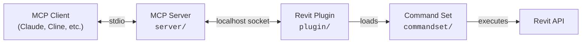

# mcp-servers-for-revit (hardened fork)

**Connect AI assistants to Autodesk Revit via the Model Context Protocol — with a locked-down local attack surface.**

This is a fork of [mcp-servers-for-revit](https://github.com/mcp-servers-for-revit/mcp-servers-for-revit). The upstream project lets MCP clients (Claude, Cline, VS Code, ...) read, create, modify, and delete elements in Revit projects. It is powerful by design: its `send_code_to_revit` tool compiles and executes arbitrary C# inside the Revit process, without authentication.

## Why this fork

A security review of upstream found no malicious code, but three things worth fixing before running it on a workstation:

1. **Loopback-only socket (security fix).** Upstream binds its TCP listener to *all* network interfaces (`IPAddress.Any:8080`). Combined with unauthenticated code execution, anyone on the same network could run C# inside your Revit session. This fork binds `IPAddress.Loopback`, so only processes on your own machine can connect. Behavior is otherwise unchanged — the MCP server always connects to `localhost`.
2. **Fully English codebase.** All Chinese comments and user-facing strings (transaction names in Revit's Undo menu, dialogs, log and error messages) are translated, so the code is fully reviewable.
3. **Environment rules embedded in the tool itself.** The `send_code_to_revit` description now carries the hard-won usage rules (the `document` variable, no `using` directives, transaction modes, Revit 2022+ API changes, the 2-minute timeout, probe-before-apply workflow). Every MCP client receives them at call time instead of relying on a separately loaded skill or prompt.

Plus small cleanups: dead tool files removed, a deploy script added (`scripts/deploy-addin.ps1`).

## Architecture



The **MCP Server** (TypeScript) translates tool calls from AI clients into JSON-RPC messages over a localhost socket. The **Revit Plugin** (C#) runs inside Revit, listens on `127.0.0.1:8080`, and dispatches commands to the **Command Set** (C#), which executes the actual Revit API operations and returns results back up the chain.

## Requirements

- **Node.js 20+** (for the MCP server)
- **Autodesk Revit 2020 - 2026**
- **.NET SDK** with the Visual Studio build tools (to build the plugin)

## Setup

This fork is run from a local build (no npm package).

### 1. Build the MCP server

```bash
cd server
npm install
npm run build
```

### 2. Build and deploy the Revit plugin

```bash
dotnet build plugin/RevitMCPPlugin.csproj -c "Release R25"      # Revit 2025
dotnet build commandset/RevitMCPCommandSet.csproj -c "Release R25"
```

(Use `Release R26` for Revit 2026, `Release R20`-`R24` for older versions on .NET Framework 4.8.)

Then, with Revit closed:

```powershell
./scripts/deploy-addin.ps1
```

This copies the built add-in into `C:\ProgramData\Autodesk\Revit\Addins\<year>\` and removes any stale manifests.

### 3. Register the server with your MCP client

Point the client at the built server with plain `node`. For Claude Code (`~/.claude.json` or `claude mcp add`):

```json
{
    "mcpServers": {
        "mcp-server-for-revit": {
            "command": "node",
            "args": ["C:\\path\\to\\revit-mcp-fork\\server\\build\\index.js"]
        }
    }
}
```

### 4. Start Revit

If prompted about an unknown add-in, click **Always Load**. Then open **Settings** on the mcp-servers-for-revit ribbon tab, enable the commands you want, and click **Save**.

To verify the security fix: `netstat -ano | findstr :8080` should show the listener on `127.0.0.1:8080`, not `0.0.0.0:8080`.

## Supported Tools

| Tool | Description |
| ---- | ----------- |
| `get_current_view_info` | Get current active view info |
| `get_current_view_elements` | Get elements from the current active view |
| `get_available_family_types` | Get available family types in current project |
| `get_selected_elements` | Get currently selected elements |
| `get_material_quantities` | Calculate material quantities and takeoffs |
| `ai_element_filter` | Intelligent element querying tool for AI assistants |
| `analyze_model_statistics` | Analyze model complexity with element counts |
| `create_point_based_element` | Create point-based elements (door, window, furniture) |
| `create_line_based_element` | Create line-based elements (wall, beam, pipe) |
| `create_surface_based_element` | Create surface-based elements (floor, ceiling, roof) |
| `create_grid` | Create a grid system with smart spacing generation |
| `create_level` | Create levels at specified elevations |
| `create_room` | Create and place rooms at specified locations |
| `create_dimensions` | Create dimension annotations in the current view |
| `create_structural_framing_system` | Create a structural beam framing system |
| `delete_element` | Delete elements by ID |
| `operate_element` | Operate on elements (select, setColor, hide, etc.) |
| `color_elements` | Color elements based on a parameter value |
| `tag_all_walls` | Tag all walls in the current view |
| `tag_all_rooms` | Tag all rooms in the current view |
| `export_room_data` | Export all room data from the project |
| `store_project_data` | Store project metadata in local database |
| `store_room_data` | Store room metadata in local database |
| `query_stored_data` | Query stored project and room data |
| `send_code_to_revit` | Execute a C# snippet in Revit (rules embedded in the tool description; supports `transactionMode: "auto" \| "none"`) |
| `say_hello` | Display a greeting dialog in Revit (connection test) |

## Security notes

- The plugin listens on loopback only; there is no authentication on the JSON-RPC channel, so any local process can drive Revit while the service is enabled. That is acceptable for a single-user workstation — do not port-forward or re-bind it.
- `send_code_to_revit` is arbitrary code execution *by design*. The only gate is which MCP client you connect and how it asks for approval.
- The npm dependency surface is four packages (`@modelcontextprotocol/sdk`, `better-sqlite3`, `ws`, `zod`); there are no install scripts and no outbound network calls anywhere in the codebase.

## Testing

The test project (`tests/commandset`) uses [Nice3point.TUnit.Revit](https://github.com/Nice3point/RevitUnit) to run integration tests against a live Revit instance. It requires the **.NET 10 SDK** and a licensed Revit 2025/2026. With Revit open:

```bash
dotnet test -c Debug.R26 -r win-x64 tests/commandset
```

## Project Structure

```
revit-mcp-fork/
├── mcp-servers-for-revit.sln    # Combined solution (plugin + commandset + tests)
├── command.json     # Command set manifest
├── server/          # MCP server (TypeScript) - tools exposed to AI clients
├── plugin/          # Revit add-in (C#) - localhost socket bridge inside Revit
├── commandset/      # Command implementations (C#) - Revit API operations
├── tests/           # Integration tests (C#) - TUnit tests against live Revit
└── scripts/         # deploy-addin.ps1, release.ps1
```

## Syncing with upstream

This fork carries three local changes on top of upstream: the loopback-only listener (`plugin/Core/SocketService.cs`), the English translation, and the enriched `send_code_to_revit` description (`server/src/tools/send_code_to_revit.ts`).

Sync periodically:

```bash
git fetch upstream
git merge upstream/main
```

Expected conflict surface: `send_code_to_revit.ts` (description block), `SocketService.cs` (one line), and any upstream file that still had Chinese comments. After merging, rebuild the server (`npm run build` in `server/`) and redeploy the plugin (`scripts/deploy-addin.ps1` with Revit closed).

## Acknowledgements

Forked from [mcp-servers-for-revit](https://github.com/mcp-servers-for-revit/mcp-servers-for-revit), itself a continuation of [revit-mcp](https://github.com/mcp-servers-for-revit/revit-mcp), [revit-mcp-plugin](https://github.com/mcp-servers-for-revit/revit-mcp-plugin), and [revit-mcp-commandset](https://github.com/mcp-servers-for-revit/revit-mcp-commandset). Thanks to the original authors for the foundation this builds on.

## License

[MIT](LICENSE)
